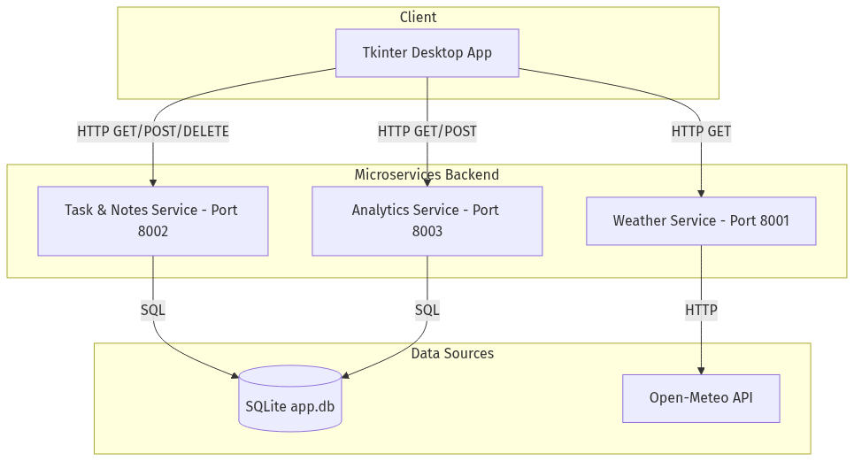
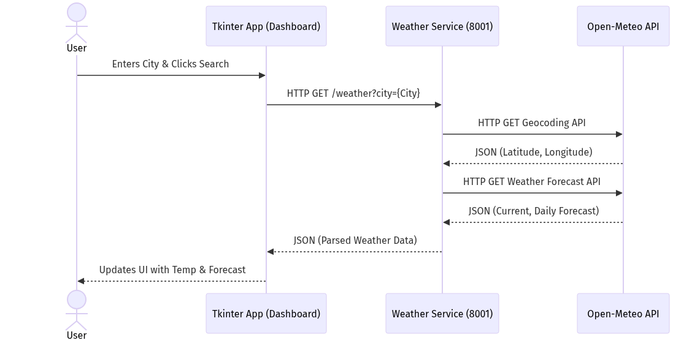
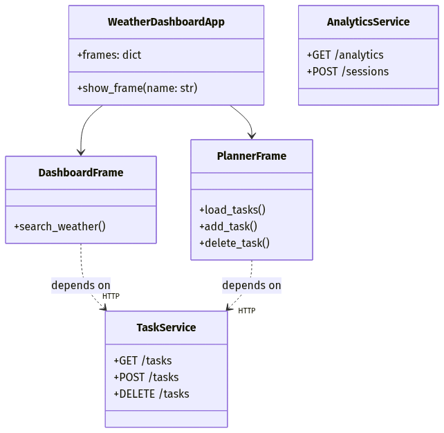
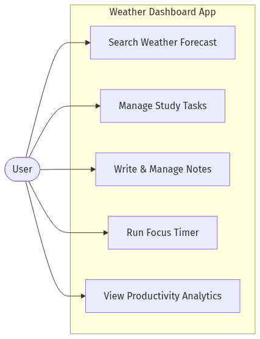
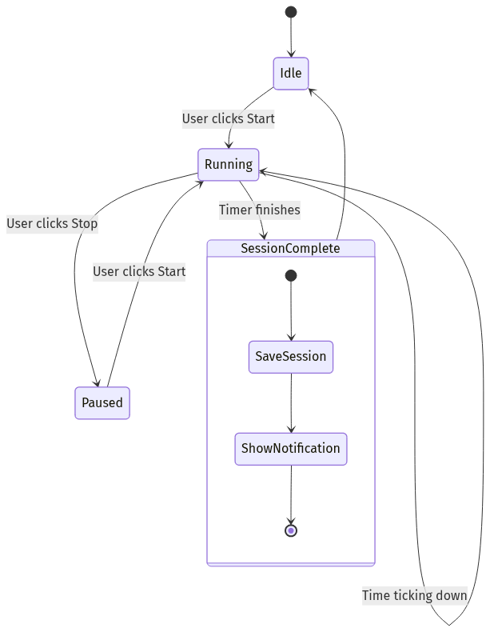

# Weather Dashboard - Microservices Architecture & UML

Here are the UML diagrams for the Weather Dashboard Desktop Application.

## 1. Component Diagram
This diagram shows the transition from a monolithic architecture to a microservices-based architecture.

## 2. Sequence Diagram
This sequence diagram illustrates the flow of data when a user searches for weather.

## 3. Class Diagram
This class diagram highlights the logical separation between the UI presentation layer and the microservices layer.

## 4. Use Case Diagram
This diagram illustrates how the user interacts with the various features of the application.

## 5. Activity Diagram
This diagram illustrates the flow of activities, such as starting a Focus Timer session and logging it.

