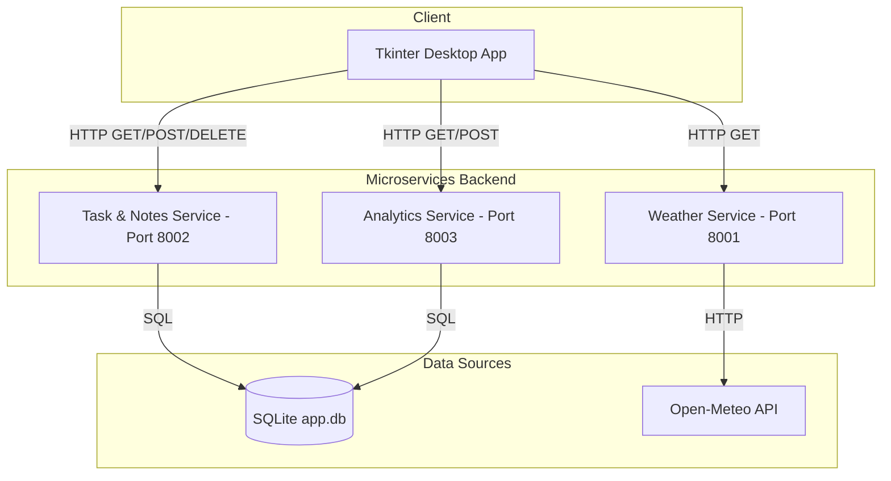
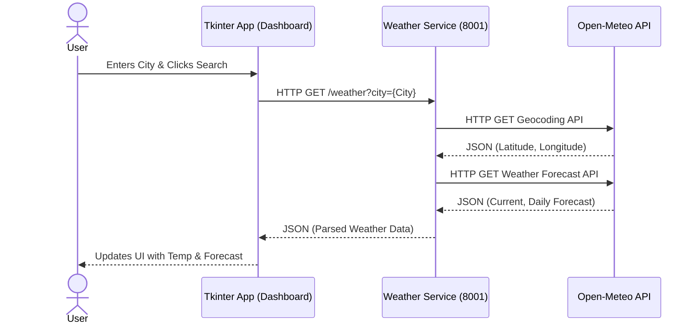
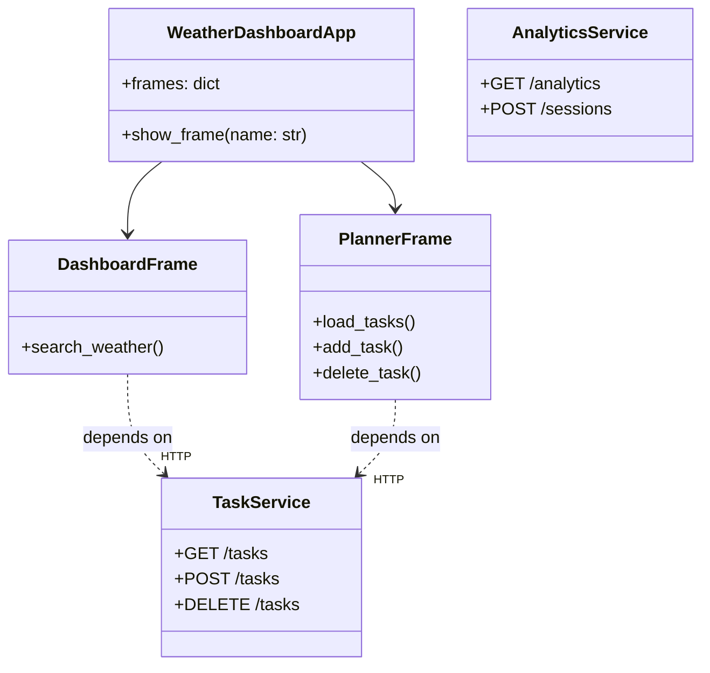

# Weather Dashboard - Microservices Architecture & UML

## 1. Component Diagram
This diagram shows the transition from a monolithic architecture to a microservices-based architecture. The Tkinter Desktop App acts as a thin client, making HTTP REST API calls to the backend microservices.

## 2. Sequence Diagram
This sequence diagram illustrates the flow of data when a user searches for weather.

## 3. Class Diagram
This class diagram highlights the logical separation between the UI presentation layer and the microservices layer.

